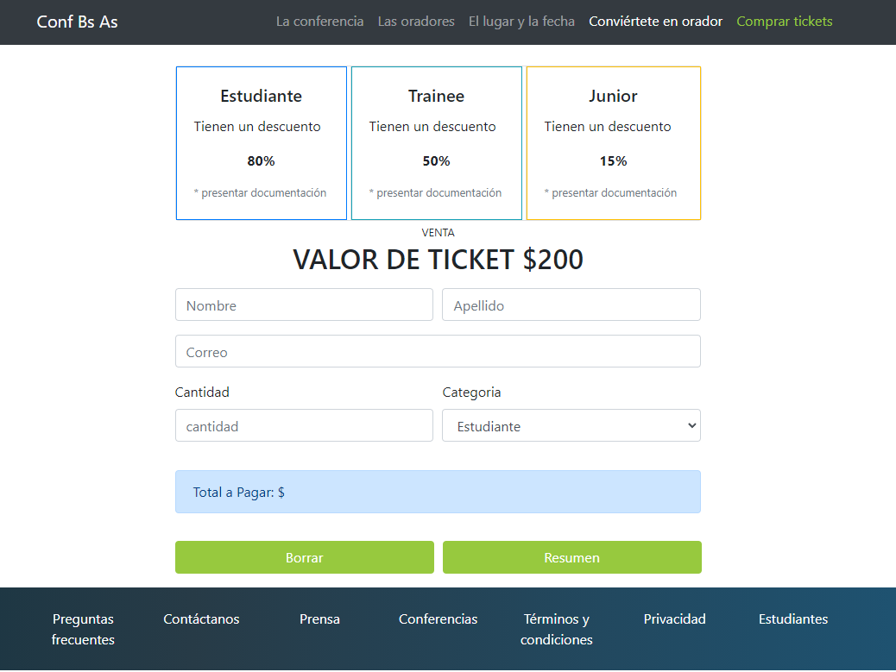

Trabajo Práctico Integrador JAVA   <strong>(FRONTEND)</strong> Consigna:
Deberán replicar la siguiente página principal con lo visto en clase hasta el momento, se recomienda usar bootstrap, se permiten cambios en el diseño;

* Descripción del proyecto:

1- Barra de navegación que colapsa y se transforma en un menú hamburguesa funcional (Header);

2- Portada, la cual tiene una imagen como background. Sobre esta texto y botones;

3- Cards con imagenes, botones y texto;

4- Carrusel con 3 diapositivas, imágenes  y texto, con controles anterior/siguiente e indicadores. Los indicadores permiten a los usuarios saltar directamente a una diapositiva en particular;

5- Un pequeño formulario, un área de texto donde los usuarios pueden escribir sus comentarios, un botón de enviar y un botón (link) que te dirige a la página Backend, los botones tienen efecto de animación;

6- Y en el pie de página un carrusel de reproducción automática (sólo con texto). Este corrusel se pausa automáticamente cuando se pasa el mouse sobre él. El carrusel tiene controles anterior/siguiente;

<strong>(BACKEND)</strong> Consigna: Deberán replicar la siguiente sección. La cual deberá contener la funcionalidad en Javascript, al momento de presionar el botón “Resumen”, deberá mostrar en la sección “Total a Pagar: $ ”, el monto correspondiente a la cantidad de tickets a comprar con el descuento correspondiente dependiendo la categoría seleccionada, existen 3 categorías, Estudiante, Trainee, Junior;

Procedimiento:

**HTML**

1- Se crean los campos del formulario: cantidad (input tipo number), categoría (select) y total (input tipo text solo lectura);

2- Se incluye un botón que llama a la función `calculateTotal()` cuando se hace clic;

**JavaScript**

3- `PRICE_PER_TICKET` es el precio base de cada boleto;

4- `DISCOUNTS` es un objeto que contiene los descuentos para cada categoría;

5- `calculateTotal()` es la función que se ejecuta al hacer clic en el botón de resumen. Obtiene la cantidad y categoría seleccionadas, calcula el precio total después del descuento, y actualiza el campo de total;

6- La página es responsive de ambos lados (Front/Back).

